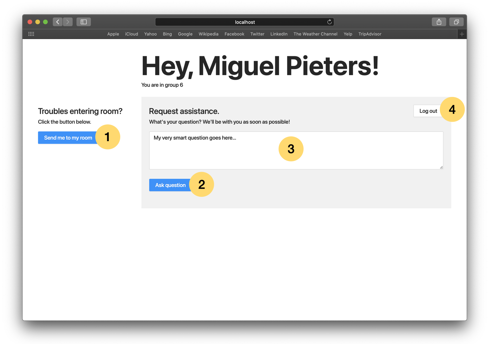
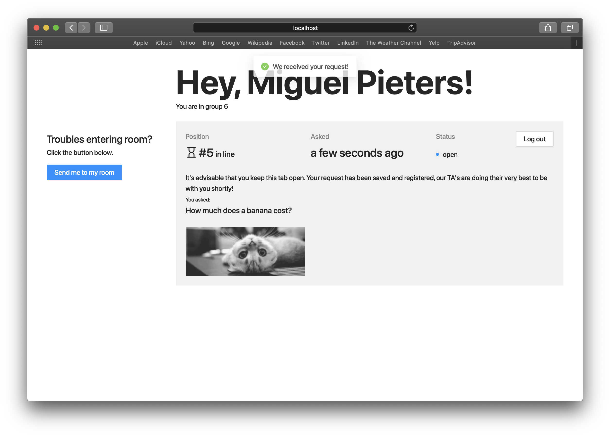
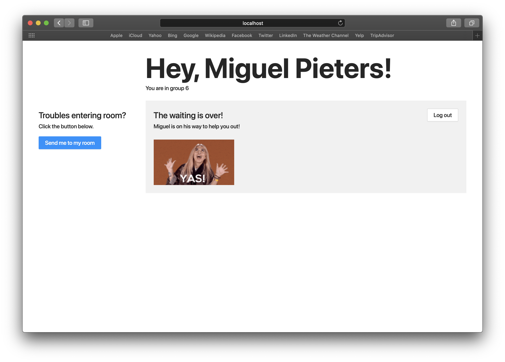
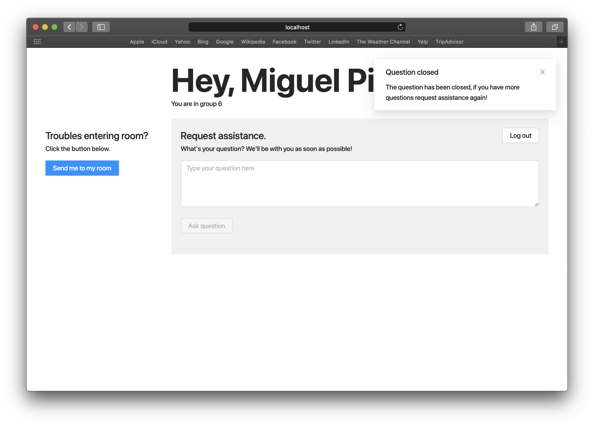
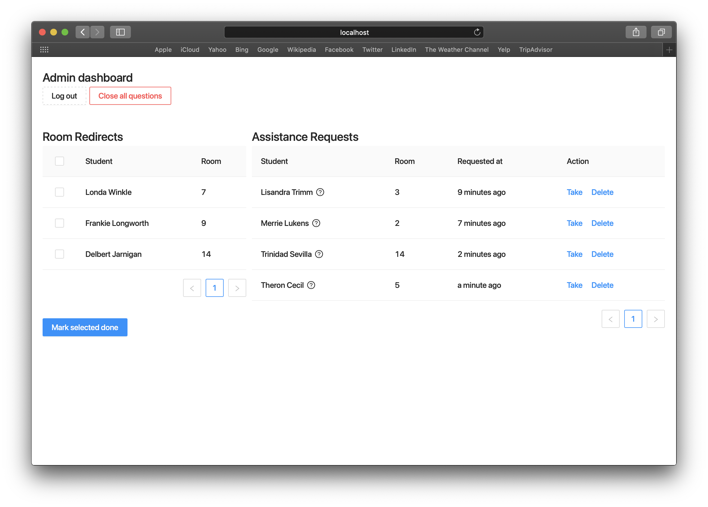
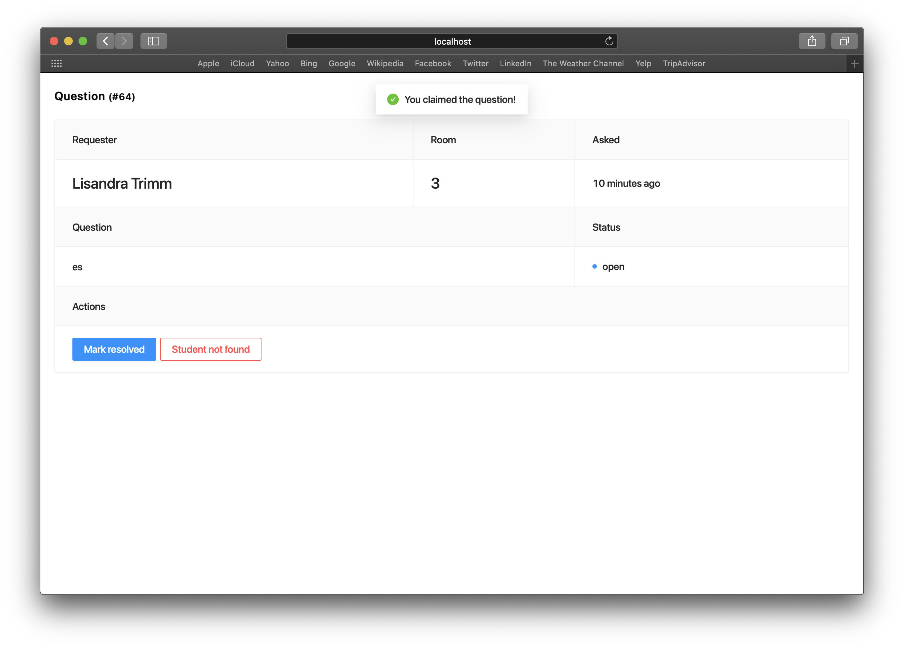
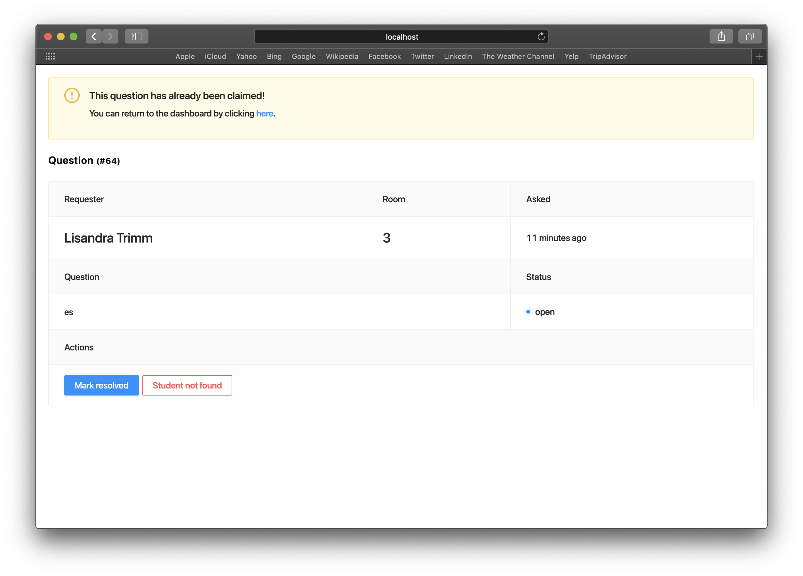

# Zoom Course Assist
A simple yet effective web application for managing breakout rooms on Zoom.

## Installation

Before running the application make sure Docker and Docker-compose are installed.

```
$ git clone git@github.com:miguelpieters/zoom-course-assist.git
$ cd zoom-course-assist
$ docker-compose -f docker-compose.staging.yml up --build
```

Production run:
``` 
$ docker-compose -f docker-compose.production.yml up --build --remove-orphans -d
```

Register initial root user
```
$ docker-compose -f docker-compose.staging.yml exec backend bash
$ python3 manage.py createsuperuser
```

Available endpoints:
- http://localhost:3000 [student dashboard]
- http://localhost:3000/hosts [teacher dashboard]
- http://localhost:8000/admin [backend administration]

Api requests start with `/api/v1/`. When running the application in development mode all endpoints are accessible by
 visiting `http://localhost:8000/api/v1`.

## User Manual

### Students

When accessing the web application students will be asked to provide their name and room number.


Once logged in a dashboard will be accessible.


1. When clicked a request will be sent to the hosts for the student to be redirected to their desired breakout room.
2. The button will be disabled when no question is provided. If clicked the question will be sent to the hosts and
 the student will be put in the queue.
 3. A textarea to enter the question.
 4. If clicked the user will be logged out.
  
#### Requesting assistance

Once the question has been asked the user will be provided with an overview of it's position in the queue. The
 information will update automatically.

#### Assistance granted

When a host becomes available and claims the question the student will be notified whom will come to their breakout
 room.

#### Closing questions

If the question is closed the student is taken back to the initial dashboard. They are free to ask another
 question if needed.

  
### Hosts

Hosts will be provided with an overview of assistance requests and room redirects. Requests are sorted by the
 creation timestamp, meaning that the most historic request will be placed on top. Room redirects can be closed by
  checking the checkbox in front of the request and then clicking on the button "Mark selected done". Questions can
   be claimed by clicking on the "Take" link.



Once taken the host will be provided with an overview of the request, such as the room to connect with.



If a notification is given that the question is already claimed than that means that another host has already taken
 the question. You are given the opportunity to go back to the main dashboard.
 


TODO: finalize manual