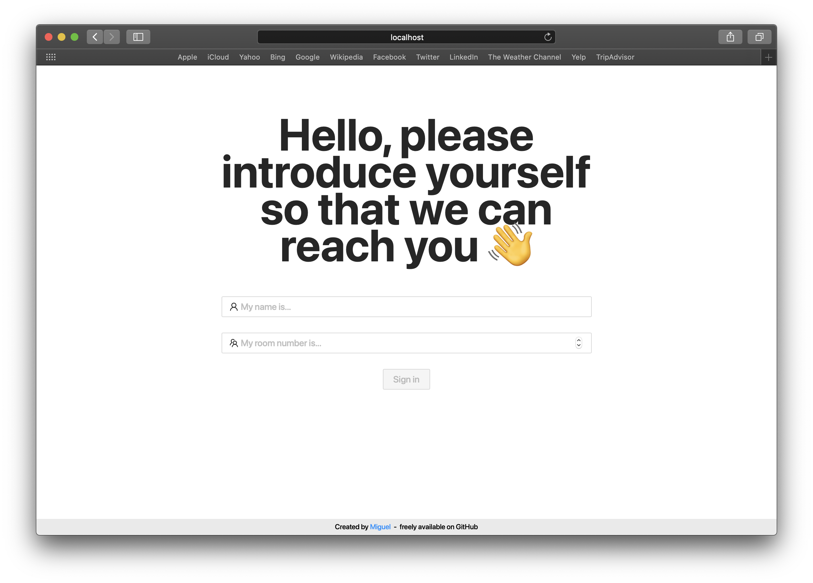
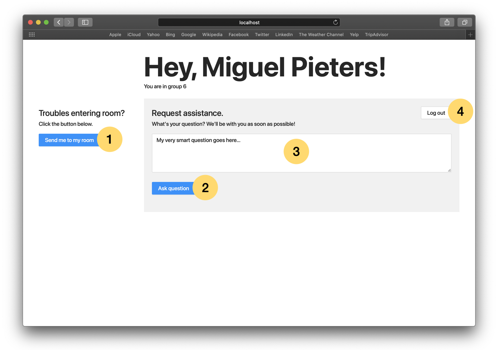

# Zoom Course Assist
A simple yet effective web application for managing breakout rooms on Zoom.

## Installation

Before running the application make sure Docker and Docker-compose are installed.

```
git clone git@github.com:miguelpieters/zoom-course-assist.git
cd zoom-course-assist
docker-compose -f docker-compose.staging.yml up --build
```

For production:
``` 
docker-compose -f docker-compose.production.yml up --build --remove-orphans
```

## User Manual

### Students

When accessing the web application students will be asked to provide their name and room number.


Once logged in a dashboard will be accessible.


1. When clicked a request will be sent to the hosts for the student to be redirected to their desired breakout room.
2. The button will be disabled when no question is provided. If clicked the question will be sent to the hosts and
 the student will be put in the queue.
 3. A textarea to enter the question.
 4. If clicked the user will be logged out.
  
### Hosts

todo: write rest of manual